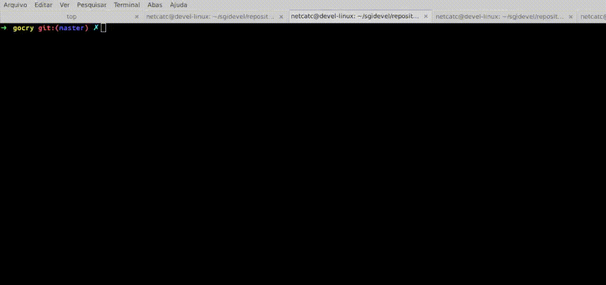

# gocry

gocry is an open-source, robust encryption tool and Go library designed for encrypting and decrypting files and strings with strong AES-based cryptography. Built using Go’s standard crypto/aes and crypto/cipher packages, it ensures data confidentiality and integrity with customizable encryption keys of varying lengths. The project features a user-friendly CLI interface supporting file encryption (--crypt), decryption (--descr), key management (--key), and token generation (--token) with flexible options.

Designed for developers and system administrators, gocry can be integrated into automated workflows, securing sensitive data in both local environments and cloud storage. It validates inputs, prevents errors, and provides clear terminal feedback using color-coded output to enhance user experience. This tool is ideal for projects requiring strong encryption with simple usability and full control over keys and tokens.

As a public project, gocry welcomes contributions, bug reports, and feature requests from the community to continuously improve security and functionality. Whether you need to protect confidential files or experiment with cryptography in Go, gocry provides a solid and extensible foundation.


**Features**

    • AES encryption and decryption of files and strings with customizable keys.
    • Supports key lengths and token generation ranging from 16 to 1024 bytes.
    • Easy-to-use CLI with clear flags for encryption (--crypt), decryption (--descr), key   management (--key), and token generation (--token).
    • Validates files before processing to prevent errors.
    • Colorful and informative terminal output for improved user experience.
    • Designed for seamless integration into Go projects or usage as a standalone utility.
    • Ideal for automating secure file management workflows and ensuring data privacy.

## Example of operation



## Packages

go get github.com/fatih/color

## Install

Provide instructions here on how to build or install the tool.
```bash
$ go build gocry.go
$ sudo mv gocry /usr/bin
```

## Example 1

```bash
$ gocry --version
$ v.1.0
$ gocry --token 32
$ Your token [32] is:  TYJDUBTQWOLBEF4YONHD4ZDEL74F3IUW
$ gocry --crypt --file ~/Downloads/crypt/ex3.png --key TYJDUBTQWOLBEF4YONHD4ZDEL74F3IUW
$ gocry --descr --file ~/Downloads/crypt/ex3.png.crypt --key TYJDUBTQWOLBEF4YONHD4ZDEL74F3IUW
```

## Example 2

```go
	
$ gocry --help

  --crypt string
    	empty

  --descr string
    	empty

  --file string
    	Exs: file.pdf

  --key string
    	default 32 bytes: [DKYPENJXW43SMOJCU6F5TMFVOUANMJNL]

  --token string
    	Generate token: 16|32|64|128|512|1024 bytes (default "32")

```
